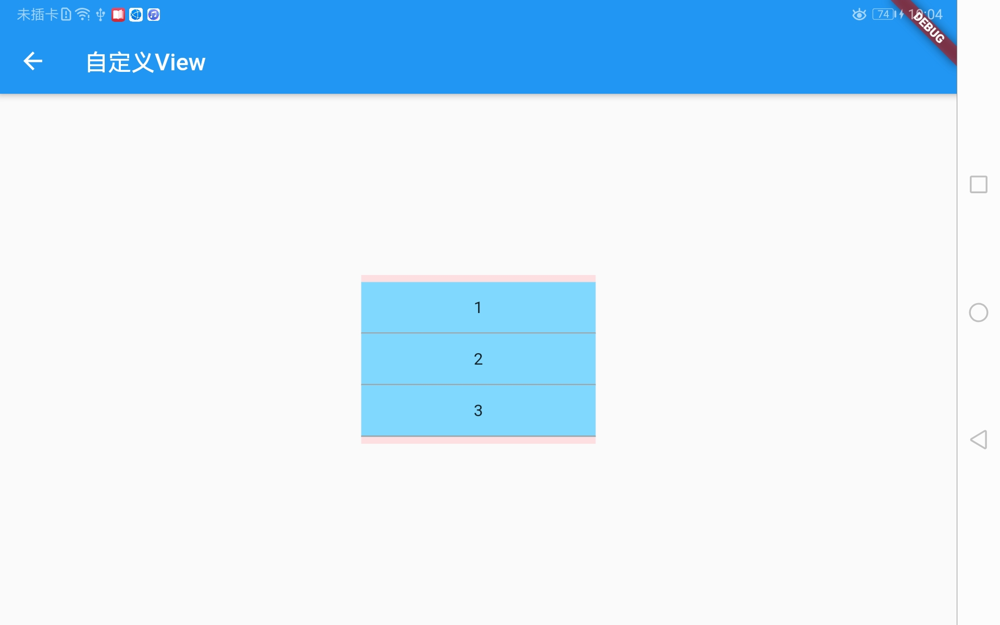
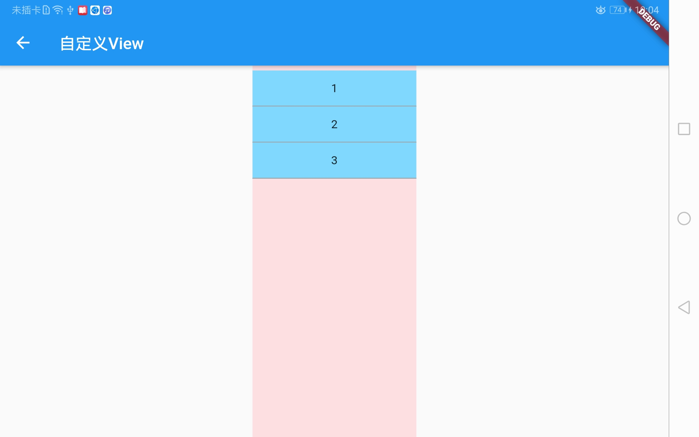
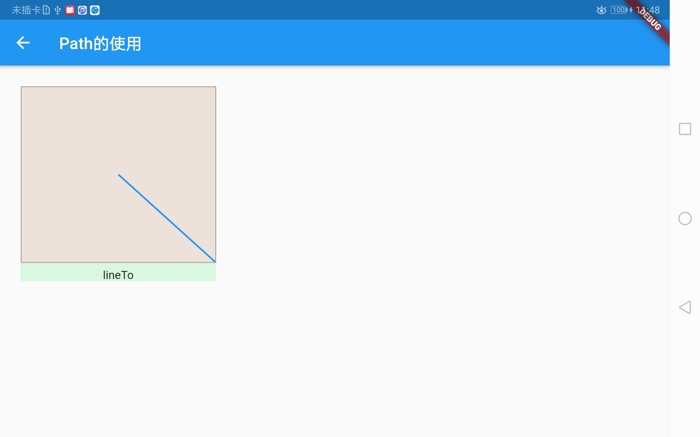
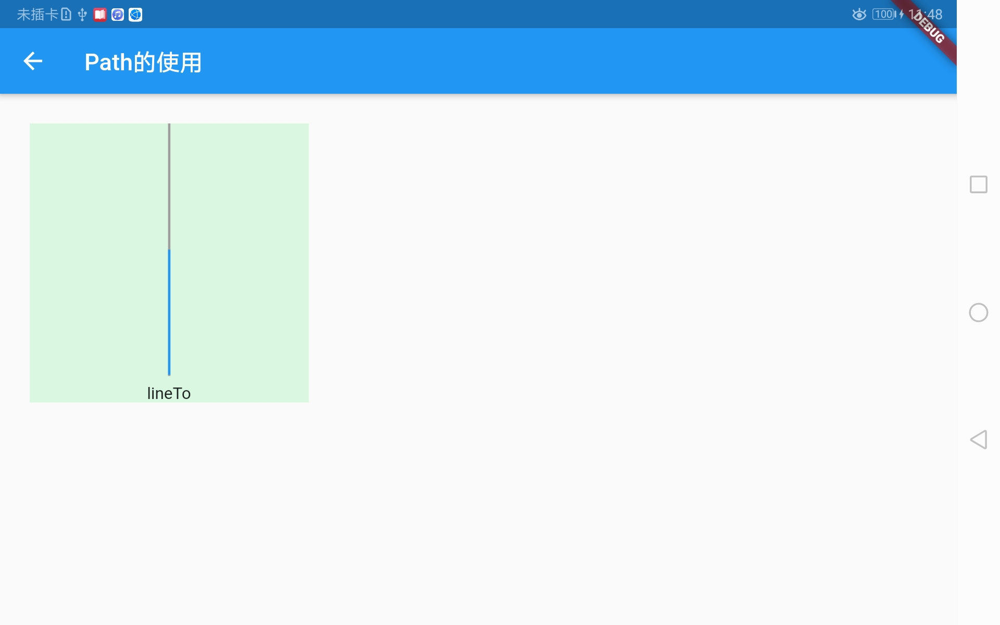

# 设置全屏沉浸式状态栏
* 方法1：在android主入口页面MainActivity.kt或MainActivity.java，判断一下版本号然后将状态栏颜色修改设置成透明
> java
   
```java
  @Override
  protected void onCreate(Bundle savedInstanceState) {
    super.onCreate(savedInstanceState);
    if (Build.VERSION.SDK_INT >= Build.VERSION_CODES.LOLLIPOP) {
      getWindow().setStatusBarColor(0);
    }
  }
```

> kotlin

```kotlin
override fun onCreate(savedInstanceState: Bundle?) {
    super.onCreate(savedInstanceState);
    if (Build.VERSION.SDK_INT >= Build.VERSION_CODES.LOLLIPOP) {
        window.statusBarColor = 0
    }
}

```

* 方法2：在Flutter的main方法中实现

```dart
if (Platform.isAndroid) {
  SystemUiOverlayStyle systemUiOverlayStyle =
      SystemUiOverlayStyle(statusBarColor: Colors.transparent);
  SystemChrome.setSystemUIOverlayStyle(systemUiOverlayStyle);
}
```

***

# UnconstrainedBox
&emsp;&emsp;允许其子组件按照其自身的大小绘制

```dart
@override
Widget build(BuildContext context) {
  return Scaffold(
    appBar: AppBar(
      title: Text('自定义View')
    ),
    body: Center(
      child: UnconstrainedBox(
        child: Container(
          padding: EdgeInsets.symmetric(
            vertical: 6
          ),
          color: Colors.red[100].withOpacity(0.6),
          width: 200,
          child: Column(
            children: <Widget>[
              _item('1'),
              _item('2'),
              _item('3')
            ],
          )
        ),
      ),
    )
  );
}

Widget _item(String text){
  return Material(
    color: Colors.lightBlueAccent[100],
    child: InkWell(
      onTap: (){

      },
      child: Container(
        height: 44,
        decoration: BoxDecoration(
          border: Border(
            bottom: BorderSide(
              color: Colors.grey
            )
          ),
        ),
        child: Row(
          mainAxisAlignment: MainAxisAlignment.center,
          children: <Widget>[
            Text(text)
          ],
        ),
      ),
    ),
  );
}
```

> 添加UnconstrainedBox时


> 没有UnconstrainedBox时


***

# FractionallySizedBox
> [ˈfrækʃənəli] adv. 很小；很少

&emsp;&emsp;一个控件的尺寸是相对尺寸时，比如当前按钮的宽度占父组件的70%，可以使用FractionallySizedBox来实现此效果。
使用FractionallySizedBox包裹子控件，设置widthFactor宽度系数或者heightFactor高度系数，系数值的范围是0-1，0.7表示占父组件的70%。

```dart
child: Column(
        children: <Widget>[
          Expanded(
            flex: 1,
            child: Container(
              margin: EdgeInsets.only(
                  bottom: ScreenUtil().setHeight(10)
              ),
              decoration: BoxDecoration(
                  color: Colors.red[100].withOpacity(0.5),
                  border: Border.all(color: Colors.grey)
              ),
//              child: child,
              child: FractionallySizedBox(child: child,widthFactor: 1,)
            ),
          ),
          Text(text,style: TextStyle(fontSize: 14),)
        ],
      ),
```

> 添加FractionallySizedBox时


> 没有FractionallySizedBox时


